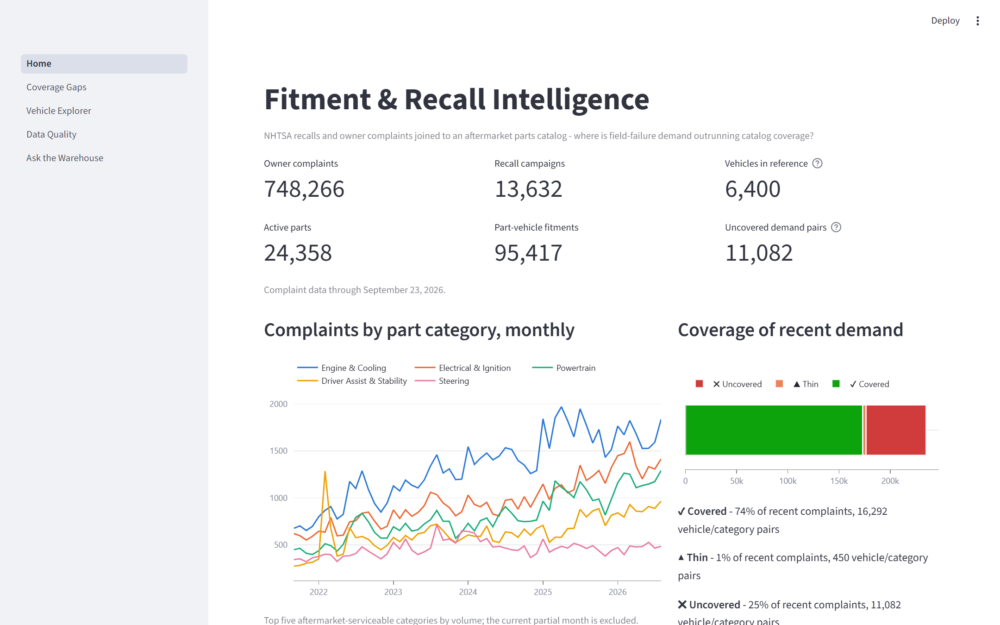
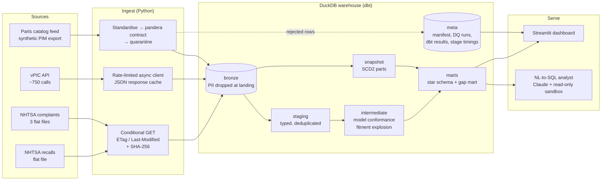
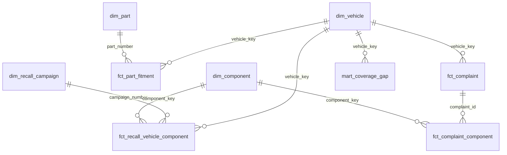
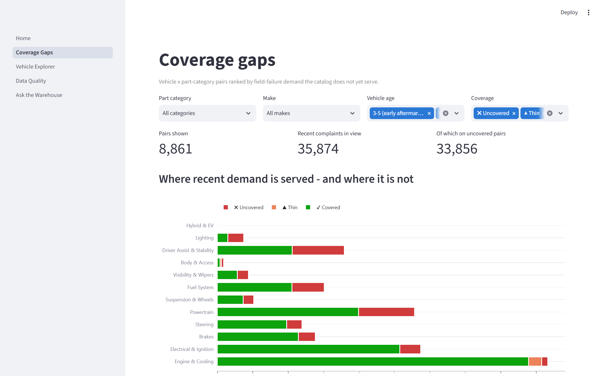
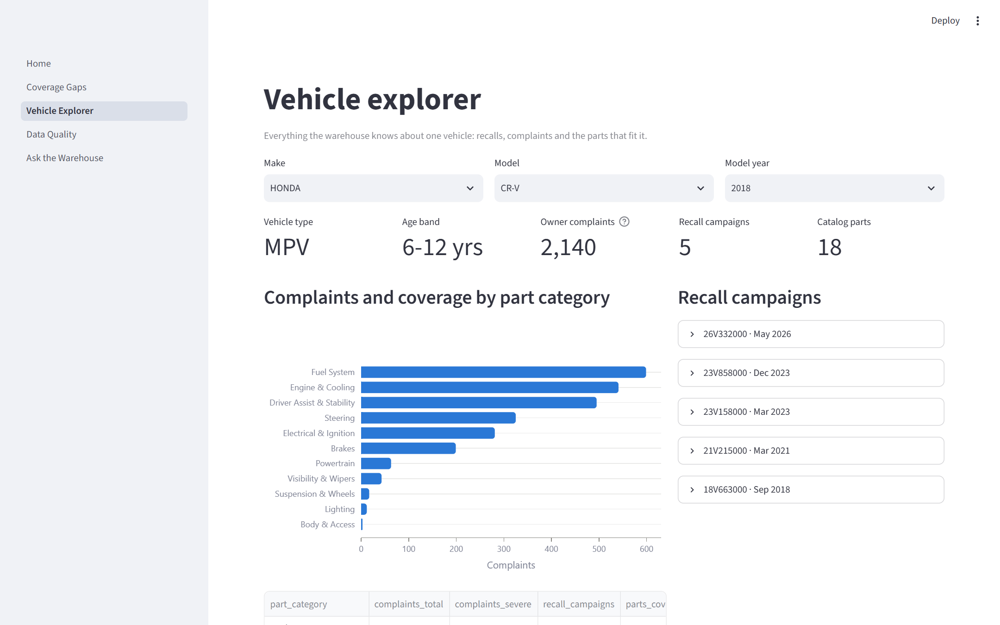
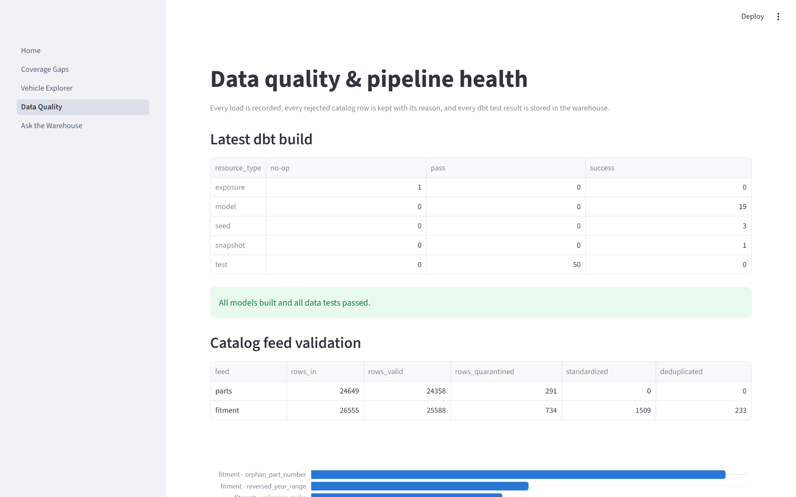

# Fitment & Recall Intelligence

[](https://github.com/adityaaay/fitment-and-recall-intelligence/actions/workflows/ci.yml)
  

**Where is field-failure demand outrunning an aftermarket parts catalog?**

An end-to-end data platform that joins **1.35M federal vehicle-safety records** (NHTSA recalls
and owner complaints) to an ACES-style **parts fitment catalog**. It then scores every
vehicle × part-category pair by how much failure demand the catalog leaves unserved.
The platform is built the way a production warehouse should be:

- **Incremental ingestion** with a load manifest.
- **Data contracts** with row-level quarantine.
- A **dbt star schema** with 50 data tests, including reconciliation tests.
- **SCD2 history** for the parts master.
- A **Streamlit** app for product managers.
- A **Claude-powered analyst** that answers questions in plain English by writing read-only
  SQL against the documented marts.



| | |
|---|---|
| **Sources** | NHTSA recall flat file (245,573 rows), three NHTSA complaint files (1,106,297 rows), NHTSA vPIC API (755 models, 7,696 model-years, 34 makes) |
| **Warehouse** | DuckDB with bronze, staging, intermediate and marts layers. 19 dbt models, 3 seeds, 1 snapshot, 50 data tests |
| **Full refresh** | 47 s end to end: download, land, validate, rebuild every model, run every test |
| **No-change refresh** | ~2 s: every source answers `304 Not Modified` and nothing is reloaded |
| **Tests** | 35 pytest tests, including a fixture-based end-to-end build of the whole warehouse in CI |

---

## Why this problem

Aftermarket parts makers decide which part numbers to engineer from **vehicles in operation**
and **failure rates**. NHTSA publishes both signals for free:

- Every recall campaign.
- Every owner complaint, with the component that failed.

The hard part is not getting the data. It is **conforming it** so it can be joined to a
catalog:

- NHTSA records trims and submodels such as "C300", "F-250 SD" and "ACCORD HYBRID". The
  vehicle reference (vPIC) and a catalog use base models such as "C-Class", "F-250" and
  "Accord".
- NHTSA components ("FUEL SYSTEM, GASOLINE:DELIVERY:FUEL PUMP") need mapping to the
  categories a catalog is organized by.
- Both sources have grain traps that silently inflate every number if you miss them.

This project handles each of those explicitly and measurably.

## Architecture



### Data model



| Model | Grain | Notes |
|---|---|---|
| `dim_vehicle` | make × model × model year | Conformed across all sources. Carries an age band and an aftermarket age weight. |
| `dim_component` | NHTSA component path | Mapped to 12 serviceable part categories by a seed taxonomy. |
| `dim_recall_campaign` | campaign | The only place campaign-level `units_affected` lives. |
| `dim_part` | part (current) | Built from the SCD2 snapshot; `version_count` tracks price and status changes. |
| `fct_complaint` | complaint (ODINO) | **Incremental** (`delete+insert`); severity is taken once per complaint. |
| `fct_complaint_component` | complaint × component | Bridge table. **Incremental.** |
| `fct_recall_vehicle_component` | campaign × vehicle × component | |
| `fct_part_fitment` | part × vehicle × position | ACES year ranges exploded to model years. |
| `mart_coverage_gap` | vehicle × part category | Demand index, coverage status, opportunity score and rank. |
| `mart_component_trends` | month × make × category | |
| `mart_data_conformance` | source | Match rates against vPIC, before and after conformance. |

---

## Engineering highlights

### 1. Model conformance: 44.7% → 93.7% of recall rows matched
NHTSA's model names are trim- and submodel-level. Only **44.7%** of in-window recall rows
matched a vPIC vehicle by exact name. `int_model_conformance` resolves each
make/model/year in this order:

1. **Exact** name match.
2. **Seeded rewrite rules**, e.g. `C300`/`AMG C43` → `C CLASS`, `ES350` → `ES`, and
   `SILVERADO 2500 HD` → `SILVERADO HD`.
3. **Longest whole-word vPIC prefix**, e.g. `F 450 SD` → `F 450` and `KONA ELECTRIC` → `KONA`.

Every row records which method matched it.

| Source | Exact-name match | After conformance |
|---|---|---|
| Recalls | 44.7% | **93.7%** |
| Complaints | 88.4% | **98.5%** |

Unmatched vehicles are kept and flagged `in_vpic = false`. Out-of-scope rows (motorcycles,
RVs, heavy trucks) are counted in `mart_data_conformance`, never silently dropped.

### 2. Grain traps, caught and tested
- **Recall units affected.** `POTAFF` is campaign-wide but repeated on every
  vehicle × component row. Summing it from the raw file gives **73.5 billion** vehicles.
  At the correct campaign grain the total is **537 million**, a **137×** overstatement.
  The model structure makes the wrong sum impossible: the value only exists on
  `dim_recall_campaign`.
- **Complaints.** The source has one row per complaint × component (1.09M rows for 781K
  complaints), with crash and injury figures repeated on each row. `fct_complaint` collapses
  to one row per complaint. `assert_one_vehicle_per_complaint` proves the collapse is
  lossless, and `assert_complaints_reconcile_to_bronze` proves every in-scope bronze
  complaint lands exactly once.

### 3. Incremental, idempotent ingestion
- Each source remembers its `ETag`, `Last-Modified` and SHA-256 in `meta.ingest_manifest`.
  An unchanged file costs one `304`.
- A changed file replaces only its own rows, delete-then-insert in one transaction, so
  re-runs never duplicate.
- Files are read positionally. When NHTSA appends columns (as it did in 2020, 2025 and
  2026), the extras are ignored and **recorded as schema drift** instead of breaking the load.
- **Personal data never lands.** Owner and dealer names, city, partial VIN and phone
  numbers are excluded at the bronze insert. This is governance by construction, not by
  access control.
- **vPIC is rate-limited by a WAF.** The async client uses a global token-spaced rate
  limiter, bounded concurrency, and jittered exponential backoff on `403/429/5xx`. It also
  caches responses, so re-runs only call the API for model years that can still change.

### 4. Data contracts and quarantine for the catalog feed
The supplier feed passes through three steps before anything reaches bronze:

1. **Standardization**: whitespace, casing, and make aliases such as `Chevy` and
   `Mercedes Benz`.
2. **A pandera contract**, validated lazily so every failure on every row is collected.
3. **A split**: valid rows are published, invalid rows go to `quarantine.*` with their
   reasons.

On the current feed:

| Feed | Rows in | Valid | Quarantined | Standardized | Duplicates removed |
|---|---|---|---|---|---|
| Parts | 24,649 | 24,358 | 291 (bad price, malformed part number, unknown category, conflicting duplicate) | 0 | 0 |
| Fitment | 26,555 | 25,588 | 734 (orphan part, reversed or impossible years, unknown make) | 1,509 | 233 |

A unit test asserts the books balance: `rows_in = valid + quarantined + deduplicated`.

### 5. Tests as documentation of the business rules
The 50 dbt data tests cover several kinds of checks:

- **Keys and relationships** across every fact and dimension.
- **Grain tests**: a package-free `unique_combination` generic test.
- **A custom `valid_model_year` test.** Its floor started at 1980. The first full build
  failed it on real complaints about 1965 Mustangs, so the floor moved to 1950. That is the
  test doing its job.
- **Singular tests**: bronze-to-warehouse reconciliation, fitment explosion completeness,
  opportunity-score rules, and a **warn-level** check that fires if new NHTSA component
  systems appear that the taxonomy doesn't cover.

Every dbt result is written to `meta.dbt_run_results` and shown on the Data Quality page.

### 6. An LLM analyst that can't hurt the warehouse
`fitment ask "…"` and the *Ask the Warehouse* page run a small, explicit tool-use loop with
Claude:

- **Grounding.** The system prompt is generated from the **dbt model and column
  descriptions** plus the live schema, so the docs and the agent can't drift apart. It also
  spells out the grain rules above.
- **Defense in depth** for LLM-written SQL:
  1. A static check: one statement, `SELECT`/`WITH` only, no DDL/DML/`PRAGMA`/`ATTACH`.
  2. A DuckDB connection opened **read-only**, with **external access disabled** and the
     **config locked**.
  3. A row cap and a query timeout.
- **Error recovery.** Binder errors go back to the model as `is_error` tool results so it
  can correct itself. The final answer ships with the exact SQL that produced it.
- **Evaluation.** `fitment eval` scores execution accuracy against
  [15 golden questions](evals/nl2sql_golden.yml) whose reference SQL was verified on the
  full warehouse. The set includes the grain traps above.

---

## What the data says

The highest-scoring gaps in the current build, from `mart_coverage_gap`:

- **Driver-assist sensors on Tesla Model 3/Y and the 2020 Ford Explorer.** High severe-complaint
  and recall counts, no aftermarket coverage.
- **Powertrain on 2014–2019 Jeep Cherokee and Grand Cherokee.** Recent complaints number in
  the hundreds.
- **Fuel System on 2017–2019 Honda CR-V, Accord and Pilot.** Several real fuel-system recall
  campaigns back this, e.g. 20V314000, the low-pressure fuel-pump recall.

About **74%** of recent (36-month) complaint demand falls on vehicle/category pairs the
catalog covers. Most of the rest concentrates in driver-assist sensors, powertrain and
electrical.

| | |
|---|---|
|  |  |
| **Coverage gaps**: demand by category, split by coverage status, with a filterable ranked list | **Vehicle explorer**: recalls, complaints and fitted parts for one vehicle |



> **About the catalog.** Aftermarket catalogs are proprietary, so the parts catalog is
> **synthetic**. It is generated deterministically on top of the real vPIC vehicle universe
> by [`catalog/generator.py`](src/fitment_intel/catalog/generator.py). Coverage is biased
> the way real programs are: shallow on the newest model years and on low-volume or EV-first
> makes. It also carries a known share of realistic feed defects. All NHTSA data is real
> and public domain. Opportunity rankings are therefore a function of real demand and a
> simulated catalog.

---

## Run it

Requires Python 3.11+.

```bash
python -m venv .venv && source .venv/bin/activate    # Windows: .venv\Scripts\activate
pip install -e ".[app,agent,dev]"
```

**Offline in under a minute:** build the whole warehouse from the bundled PII-scrubbed NHTSA
extracts in `tests/fixtures`.

```bash
fitment run --sample
fitment dashboard
```

**Full data:** download ~100 MB from NHTSA and make ~750 polite vPIC calls. The first run
takes about 10 minutes because of vPIC rate limiting; later runs take under a minute.

```bash
fitment run
```

**Ask the warehouse.** This needs Claude API access (`ANTHROPIC_API_KEY`).

```bash
fitment ask "Which 2016-2019 vehicles have the most fuel system complaints but no catalog coverage?"
fitment eval
```

| Command | What it does |
|---|---|
| `fitment ingest [--sample] [--force]` | Land NHTSA files and vPIC into bronze (incremental) |
| `fitment catalog [--revision N]` | Generate, validate and publish the catalog feed. Revision 2+ reprices parts, which drives the SCD2 snapshot |
| `fitment transform [--full-refresh]` | `dbt build`: seeds, snapshot, models and tests |
| `fitment run` | All three stages, with per-stage timings recorded in `meta.pipeline_runs` |
| `make docs` | dbt docs site with the lineage graph |
| `pytest` | Unit tests plus the end-to-end fixture build |

Configuration comes from environment variables: `FITMENT_WAREHOUSE`, `FITMENT_DATA_DIR`,
`FITMENT_FIRST_MODEL_YEAR`, `FITMENT_VPIC_RPS`, and `FITMENT_CLAUDE_MODEL` (default
`claude-opus-5`).

## Repository layout

```
src/fitment_intel/
  ingest/      flatfiles.py (manifest, drift, PII), vpic.py (rate-limited async), http.py
  catalog/     generator.py (synthetic ACES-style feed), validate.py (contracts + quarantine)
  transform/   dbt_runner.py (in-process dbt, results persisted to meta)
  agent/       analyst.py (tool-use loop), sql_guard.py (sandbox), schema_context.py, evaluate.py
  cli.py       fitment <command>
dbt/
  models/      staging -> intermediate -> marts, with YAML docs that also ground the LLM
  seeds/       component_taxonomy, make_aliases, model_rewrite_rules
  snapshots/   snap_catalog_parts (SCD2)
  tests/       reconciliation + business-rule singular tests, generic tests
app/           Streamlit: Home, Coverage Gaps, Vehicle Explorer, Data Quality, Ask the Warehouse
evals/         golden NL-to-SQL question set
scripts/       make_fixtures.py (PII-scrubbed extracts), capture_screenshots.py
tests/         pytest: ingestion, contracts, SQL sandbox, agent loop, end-to-end build
```

## Design decisions

- **DuckDB + dbt, not a cloud warehouse.** The whole platform runs on a laptop and in CI with
  no credentials. The dbt models are ANSI-leaning SQL, so moving to Snowflake, BigQuery or
  SQL Server is an adapter change plus a handful of dialect functions.
- **Seeds for business knowledge.** The component taxonomy, make aliases and model rewrite
  rules are reviewable CSVs, not code. A product manager can extend the taxonomy in a pull
  request.
- **Quarantine, not failure.** A bad supplier row shouldn't block a publish, and it shouldn't
  vanish either. It is kept with its reasons and counted.
- **The analyst returns SQL, not just prose.** Every number is auditable, and the golden set
  turns "the chatbot seems right" into a measured accuracy.

## Data sources

- NHTSA Office of Defects Investigation: [recalls and complaints flat files](https://www.nhtsa.gov/nhtsa-datasets-and-apis)
  (public domain; field layouts in `RCL.txt` and `CMPL.txt`).
- NHTSA [vPIC API](https://vpic.nhtsa.dot.gov/api/) for makes, models and vehicle types.

## License

MIT
